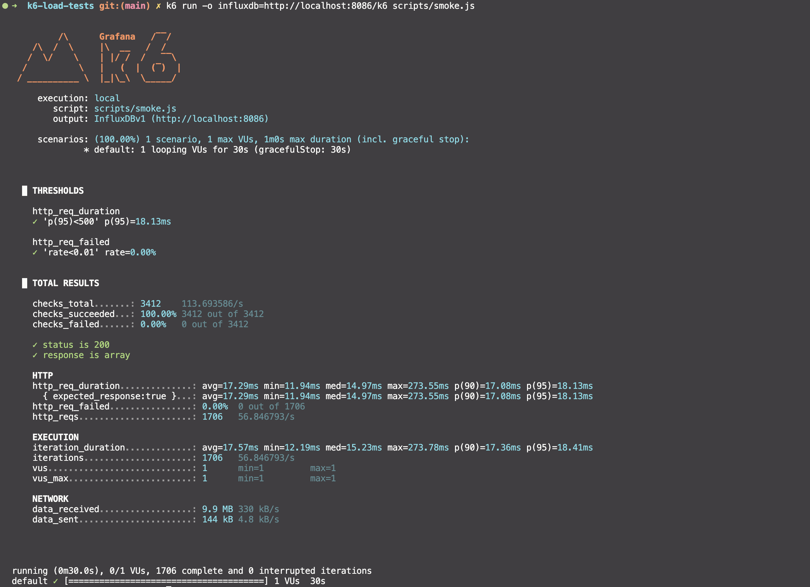
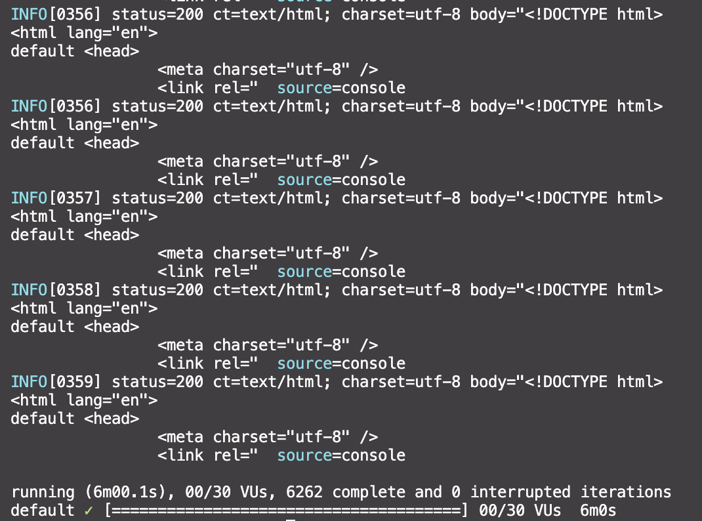
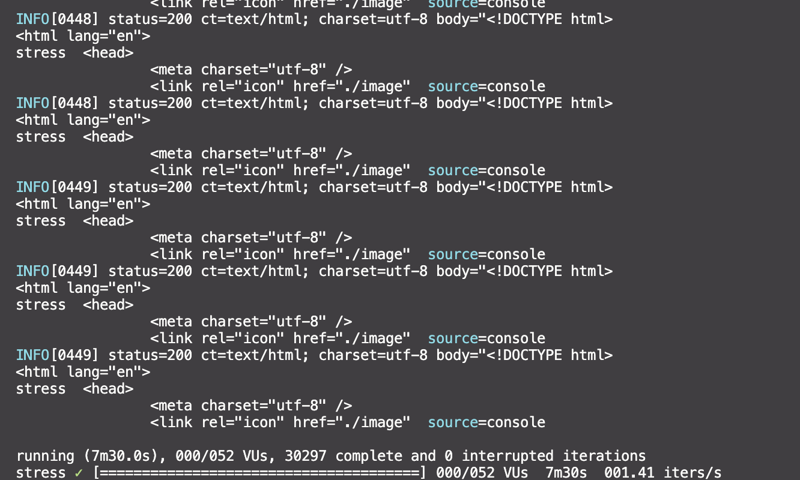
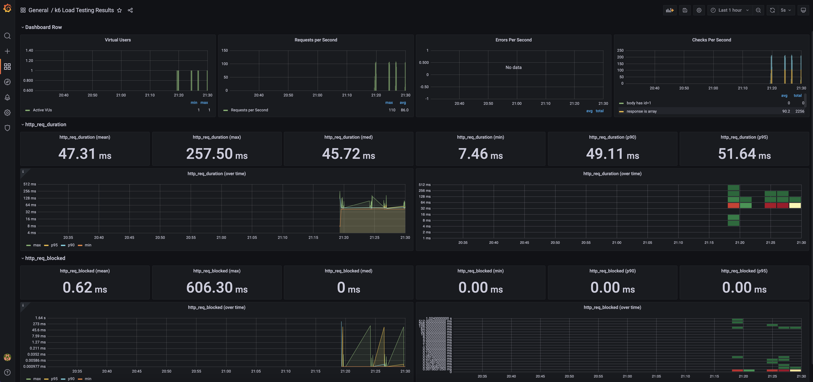
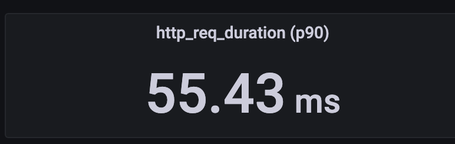

# k6 Load Tests


# 📊 K6 Load & Stress Testing with Grafana + InfluxDB

## 🚀 About the Project

This project demonstrates how to perform **API load testing** with [K6](https://k6.io/), collect metrics in **InfluxDB**, and visualize results in **Grafana**.

We implemented 3 types of tests:

- 🔹 **Smoke test** – check that the API is alive and responds correctly.
- 🔹 **Load test** – measure how the API behaves under increasing load.
- 🔹 **Stress test** – test the system under extreme conditions.

---

## ⚙️ Tech Stack

- [K6](https://k6.io/) – performance testing tool
- [InfluxDB](https://www.influxdata.com/) – time-series database for metrics
- [Grafana](https://grafana.com/) – visualization platform
- [Docker Compose](https://docs.docker.com/compose/) – orchestration for local setup

---

## 📥 Setup & Run

1. Start infrastructure:

```bash
docker compose up -d
```

2. Run a test (example: smoke test):

```bash
k6 run -o influxdb=http://localhost:8086/k6 scripts/smoke.js
```

3. Open Grafana:  
   👉 [http://localhost:3000](http://localhost:3000)  
   (default credentials: `admin / admin`)

---

## 🧪 Test Screenshots

### ✅ Smoke Test



---

### 📈 Load Test



---

### 🔥 Stress Test



---

### 📊 Grafana Dashboard



---

### ⏱ p90 Latency



---

## 📌 Metrics Tracked

- `http_req_duration (p90)` – 90% of requests finished faster than this time
- `http_req_duration (avg)` – average request duration
- `http_req_failed` – percentage of failed requests
- `vus` – number of virtual users

---

## 🏁 Conclusions

- ✅ The API successfully passes **smoke tests** (availability check).
- 📈 Under moderate load, the system demonstrates stable response times.
- 🔥 Under stress, performance decreases but the system remains operational.
- 📊 Grafana dashboards make it easy to analyze **p95, p90, avg, max** and identify bottlenecks.
